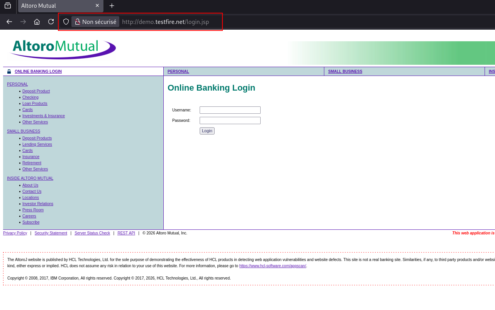
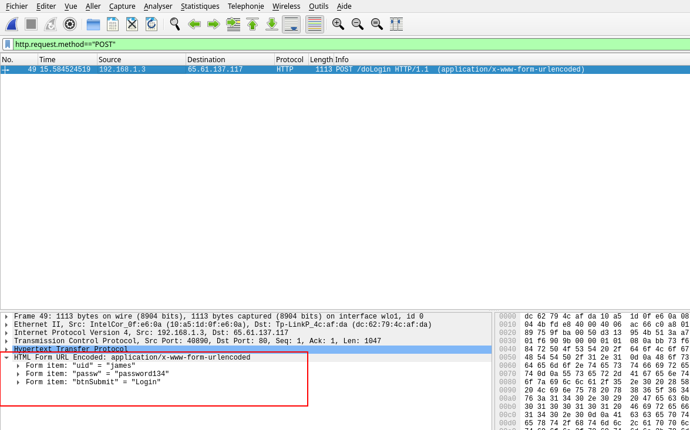

# Les dangers des réseaux publiques - les idées reçues sur le HTTPS
Cette démonstration peut être utilisée à la fois pour aborder la question des données échangées sur des wifis publiques et pour démonter les idées reçues sur la "sécurité" des sites en https.

L'idée est de rentrer des informations de connexion sur un site en http volontairement vulnérable et d'espionner le trafic réseau. L'audience prendra ainsi concience que les données sont visibles en clair par quelqu'un connecté au même réseau.

## Remarque pédagogique 
Mes missions s'adressent à un public néophyte, de tous secteurs d'activité, avec des profils non techniques variés. La démonstration et l'explication sont volontairement simplifiées et idéalisées pour que le message passe avant tout. L'idée n'est pas que le public comprenne les enjeux techniques pour reproduire la démonstration, mais qu'ils comprennent les risques liés à tel ou tel comportement. 
Ainsi, une attaque Middle-man n'est bien évidemment par aussi simple, et le résultat est quelque peu différent, mais l'objectif n'est pas ici.


## Outils nécessaires
Pour mener à bien cette démonstration, il faudra : 
- Un environnement Linux (ici, ParrotOs)
- Wireshark
- un réseau wifi **personnel** - Ne pas utiliser le réseau de la structure d'accueil. Un partage de connexion avec son téléphone personnel est le plus simple
- un site web volontairement vulnérable, en http : http://demo.testfire.net/login.jsp (**site à usage pédagogique uniquement**)


## Mise en oeuvre
Imaginons que nous voulions nous connecter à ce site internet. Faire remarquer que le site est en http uniquement. 


En parallèle, lancer une capture Wireshark. Afin de ne pas perdre l'audience, prévoir à l'avance les filtres à utiliser pour ne pas noyer l'information pertinente : 
```http.request.method=="POST"```

Rentrer des informations de connexion (**bien sur, ne pas utiliser de réelles informations**). Mettre fin à la capture Wireshark. Cliquer sur l'unique ligne relevée, et faire dérouler la section "HTML form URL Encoded" dans le menu en bas à gauche.


On relève facilement les informations transmises sur le formulaire de connexion.

## Vidéo
Ci dessous la vidéo de démonstration
